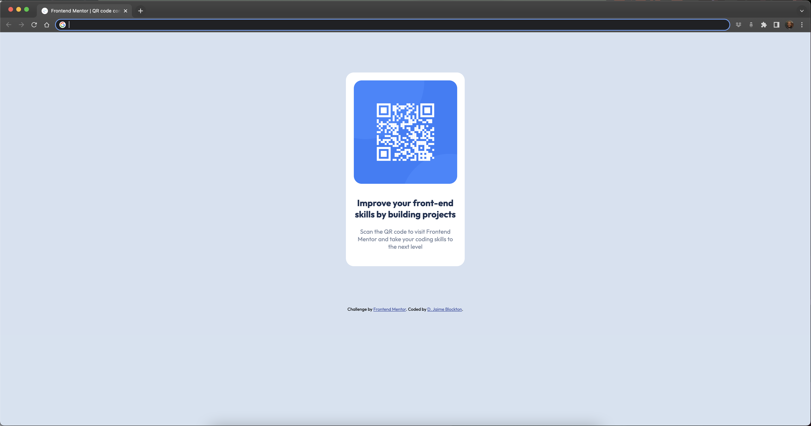

# Frontend Mentor - QR code component solution

This is a solution to the [QR code component challenge on Frontend Mentor](https://www.frontendmentor.io/challenges/qr-code-component-iux_sIO_H). Frontend Mentor challenges help you improve your coding skills by building realistic projects. 

## Table of contents

- [Overview](#overview)
  - [Screenshot](#screenshot)
  - [Links](#links)
- [My process](#my-process)
  - [Built with](#built-with)
  - [What I learned](#what-i-learned)
- [Author](#author)

## Overview

### Screenshot

  

### Links

- Solution URL: [(https://github.com/digigrrl525/FM-qr-code-solution)](https://github.com/digigrrl525/FM-qr-code-solution)
- Live Site URL: [(https://digigrrl525.github.io/FM-qr-code-solution/)](https://digigrrl525.github.io/FM-qr-code-solution/)

## My process

Started writing HTML, switched to CSS to style, and then used the Chrome inspector to touch up code.

### Built with

- Semantic HTML5 markup
- CSS custom properties

### What I learned

I learned how to create a webpage based on sight and a simple style guide.  

## Author

- Frontend Mentor - [@digigrrl525](https://www.frontendmentor.io/profile/digigrrl525)
